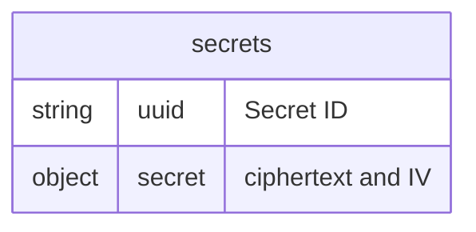
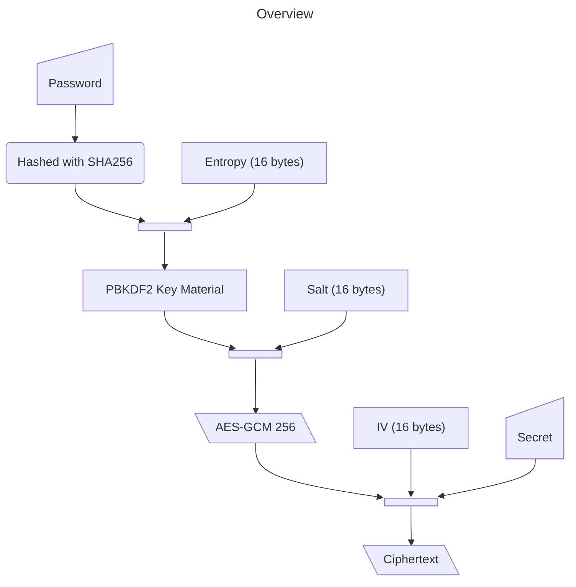

# Secrets

## Overview

An application that enables secure text sharing between parties using password-based encryption. The application uses PBKDF2 for key derivation and AES-GCM for secure encryption and decryption.

## Features

- Strong password-based key derivation (PBKDF2)
- AES-GCM encryption for confidentiality and authenticity
- Random entropy for enhanced security
- Simple to generate a URL with a hash parameter for private viewing

## Usage

1. Input the secret to be encrypted
2. Enter a password for encryption and click Encrypt
3. Share the URL and password with the intended recipient
4. Recipient uses the same password to decrypt the message

## Storage

All secrets are stored encrypted with their IV. The client stores the entropy and the salt used to derive the key within a `location.hash` parameter for private viewing. A user must provide a password to properly generate the decryption key.

The following information is stored for 24 hours in a Cloudflare KV store. If the secret is accessed beforehand it is deleted upon retrieval. There is a 32KB limit on all secrets stored.

## Encryption

## Limitations

- Requires secure password sharing channel
